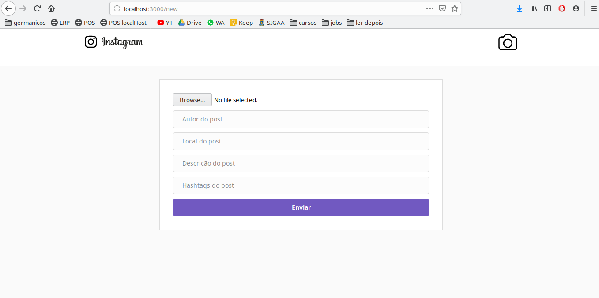
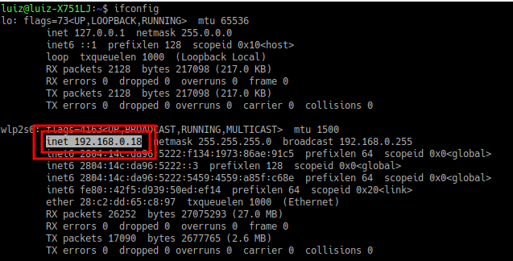

# Instagram

Esta é uma aplicação react que simula o aplicativo do [instagram](https://www.instagram.com/)

Conta com um servidor node e conexão com o mongoDB

feed:


novo feed:


emulador do mobile:


Foi realizado durante a a omnistack7 da [rocketseat](https://rocketseat.com.br/)

# Features Implementadas
- feed de postagens

- upload de fotos

- like

- broadcast e atualização em tempo real em diferentes dispositivos
    - se um browser der like em uma foto ou fizer uma nova postagem, as mudanças vão aparecer para todos os usuários logados

# Como rodar

## Configurar ip

Pelo seu terminal digite `ifconfig` e veja qual o seu local_ip


Nos arquivos `frontend/src/consts.js` altere a variável `local_ip`

## Front e Back

- Instalar Node

```sh
sudo apt-get install -y curl
```

```sh
sudo curl -sL https://deb.nodesource.com/setup_8.x |sudo -E bash
```

```sh
sudo apt-get install -y nodejs
```

- instalar yarn

[instalação do yarn](https://yarnpkg.com/pt-BR/docs/install#debian-stable)


- OBS: se você, como eu veio do NPM, taí um [link](https://yarnpkg.com/lang/pt-br/docs/migrating-from-npm/) para ajudar na transição


## BackEnd

- Basta ir para o diretório do backend
```sh
cd backend
```

e instalar as dependências
```sh
yarn install
```

e depois é só colocar o servidor para "ouvir" as requisições
```sh
node src/index.js
```


## FrontEnd

- [react](https://reactjs.org/docs/getting-started.html)

- Basta ir para o diretório do frontend
```sh
cd frontend
```

e instalar as dependências
```sh
yarn install
```

Rodar no browser
```sh
yarn start
```

## Mobile

Instalar as dependencias

```sh
cd mobile
yarn install
```

Primeira instalacao (precisa do celular conectado via USB)

```sh
react-native run-android

ou

react-native run-ios
```


# TODO:

- Usuario pode fazer comentario
- deletar um post
- Codigo e comentarios no codigo em ingles