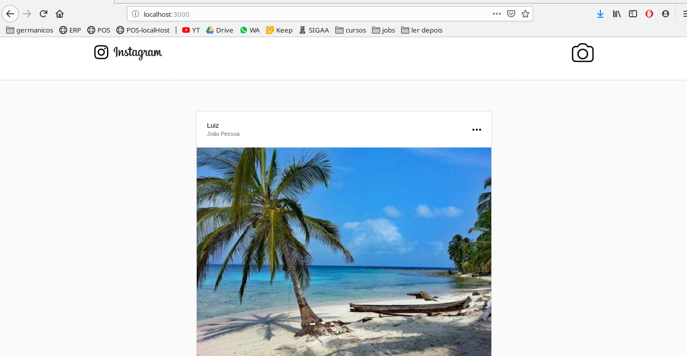

# Instagram

Esta é uma aplicação react que simula o aplicativo do [instagram](https://www.instagram.com/)

Conta com um servidor node e conexão com o mongoDB

feed:


novo feed:


Foi realizado durante a a omnistack7 da [rocketseat](https://rocketseat.com.br/)

# Features Implementadas
- feed de postagens

- upload de fotos

- like

- broadcast e atualização em tempo real em diferentes dispositivos
    - se um browser der like em uma foto ou fizer uma nova postagem, as mudanças vão aparecer para todos os usuários logados

# Como rodar

## Front e Back

- Instalar Node

> **TODO: colocar link de instalção do node**

- instalar yarn

[instalação do yarn](https://yarnpkg.com/pt-BR/docs/install#debian-stable)


- OBS: se você, como eu veio do NPM, taí um [link](https://yarnpkg.com/lang/pt-br/docs/migrating-from-npm/) para ajudar na transição


## BackEnd

- Basta ir para o diretório do backend
```sh
cd backend
```

e instalar as dependências
```sh
yarn install
```

e depois é só colocar o servidor para "ouvir" as requisições
```sh
node src/index.js
```


## FrontEnd

- react

> **TODO: colocar link de instalação do react**

- Basta ir para o diretório do frontend
```sh
cd frontend
```

e instalar as dependências
```sh
yarn install
```

Rodar no browser
```sh
yarn start
```